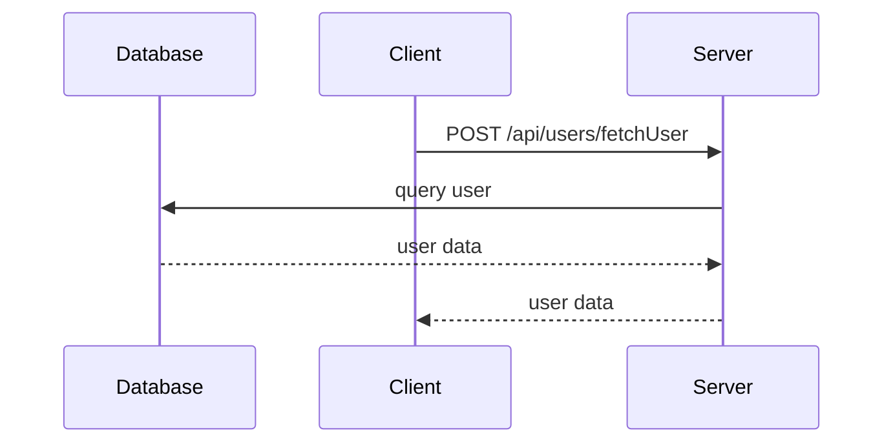

# LOGIN FLOW 

### The following is the HTTP API flow for when a client logs into the website 

```mermaid
sequenceDiagram
    participant DB as Database
    participant Client
    participant Server
    Client->>Server: POST /api/users/fetchUser
    Server->>DB: query user
    DB-->>Server: user data
    Server-->>Client: user data
```

The client should be existent, might need to do some error handling for that besides an alert
