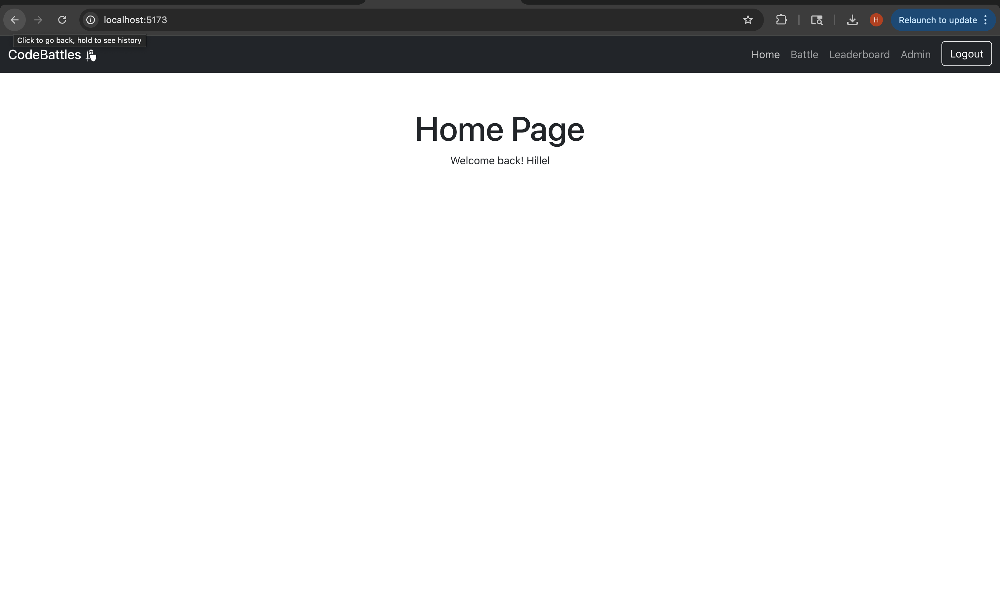
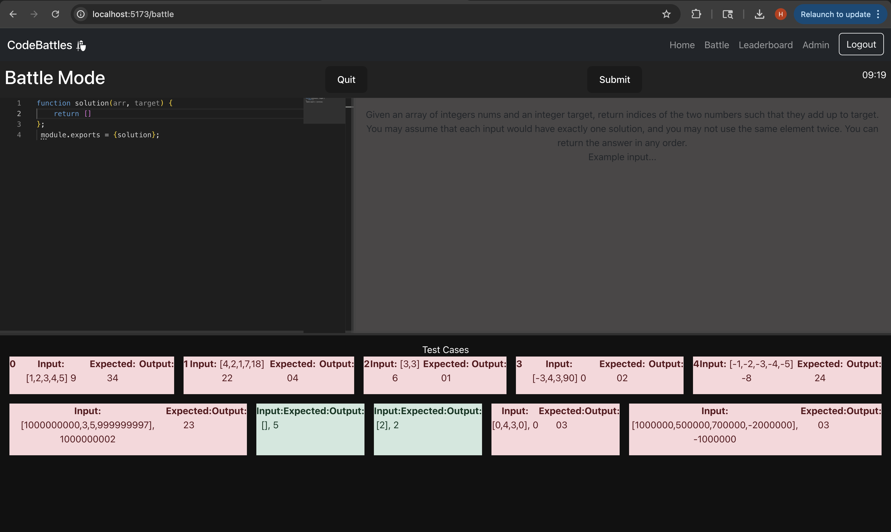

# Code Battles 

#### Sick of grinding leet-coding problems by yourself? Well you've come to the right place! 

##### Currently the website is only in its developing stages 

## Table of Contents 
1. [Demo](#demo)
2. [Features](#features)
3. [Tech Stack](#tech-stack)
4. [Getting Started](#getting-started)
5. [Future Plans](#future)

## Demo 
Here's how the app is looking so far: 

#### Home Page


#### Battle page


###### Would Love to work on the ui more but for now good functionality is key

## Features
- Real-time 1v1 coding battles with live matchmaking
- Syntax-highlighted code editor (Monaco Editor)
- Multiple test cases per problem
- Timer for each battle with automatic submission when time runs out
- Live results broadcast to opponent (win/lose/quit states)
- Resume match after page refresh
- User authentication and session management

## Tech Stack 
### Frontend
- React
- Monaco-editor
- react split pane
- STOMP.js

### Backend 
- Spring Boot
- Spring WebSocket (STOMP)
- Hibernate
- Maven
- Docker
- Database is currently local using mySql 

## Getting started

### Docker
#### if you dont want to do local development or install all the dependencies 
#### Run 
```bash
docker compose up --build
```
#### (Must have docker cli and desktop installed)

### Prerequisites for local development
- Node.js >= 18
- Java 17+
- Maven 
- MySQL 
- Docker cli and Desktop

### Run Backend 
```bash
cd server
mvn spring-boot:run 
```

### Run Frontend 
```bash
$ npm install
$ npm run dev
```
## Future Plans 
- Must figure out how to preserve users Match State in the front end in case the backend goes down
- Add Documentation to many of the Socket/API connections and calls
- Add Testing to many of the Database calls in the backend 
- integrate Spring security into backend. 
- Make a demo website to be up for people to check out 
- much later but start thinking about migrating to an actual server (cloud?)