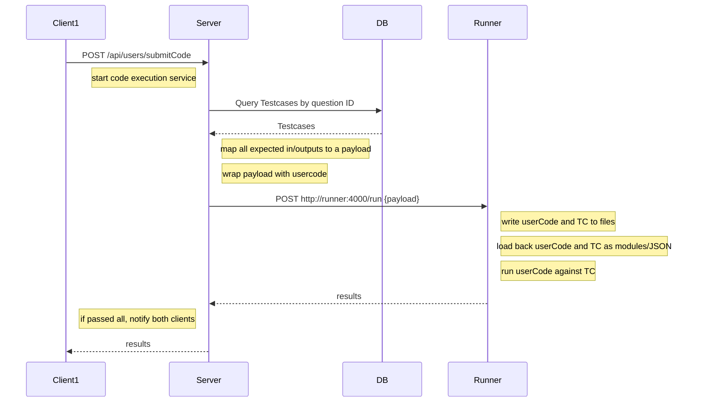

# The following is the network flow for when a user submit their code 
### Note that this is using REST API and not WebSockets

```mermaid
sequenceDiagram
    participant Client1
    participant Server
    participant DB
    participant Runner
    
    Client1->>Server: POST /api/users/submitCode
    note left of Server: start code execution service
    Server->>DB: Query Testcases by question ID
    DB-->>Server: Testcases
    note right of Server: map all expected in/outputs to a payload
    note right of Server: wrap payload with usercode 
    Server->>Runner: POST http://runner:4000/run {payload}
    note right of Runner: write userCode and TC to files
    note right of Runner: load back userCode and TC as modules/JSON
    note right of Runner: run userCode against TC
    Runner-->>Server: results
    note left of Server: if passed all, notify both clients
    Server-->>Client1: results
    
```