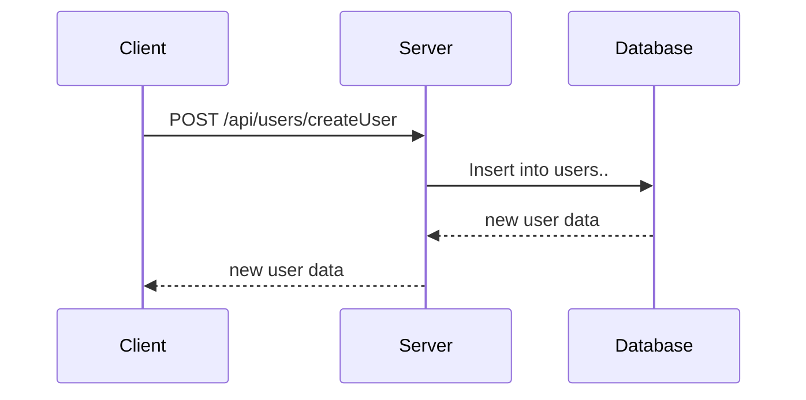

# Create User Flow 

#### the following is a flowchart documenting the users creating a new account

```mermaid
sequenceDiagram
    Client->>Server: POST /api/users/createUser
    Server->>Database: Insert into users..
    Database-->> Server: new user data
    Server-->>Client: new user data
```