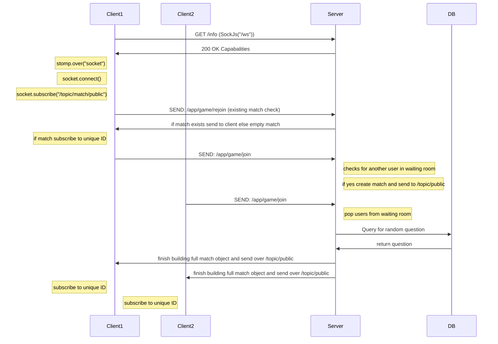

# the following is a flowchart of what happens when a user clicks on the battle button
### All requests regarding adding users to wait queue are done syncronously
#### For a future refactor we can have every match sent directly to the user instead of checing in public

